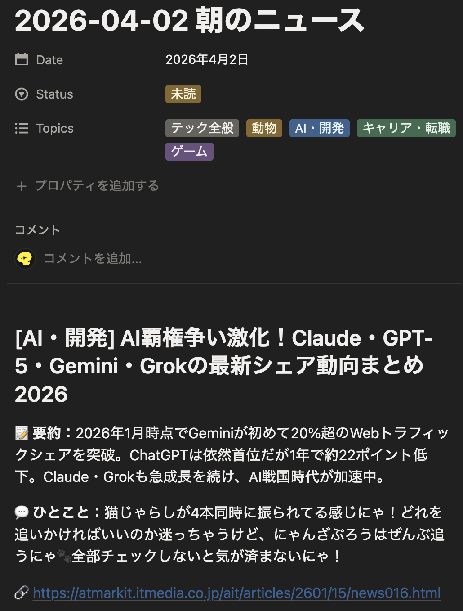
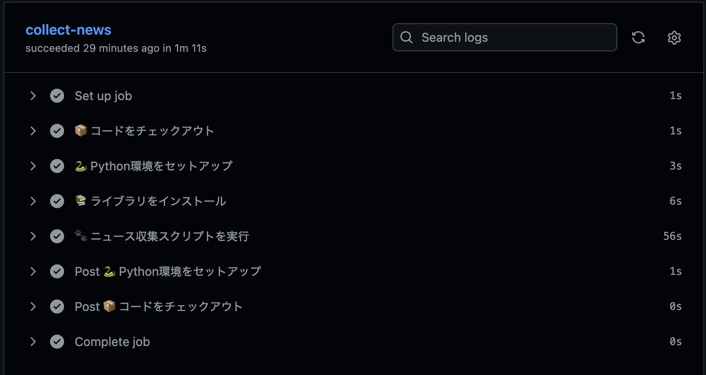

# 📰 news-auto-notion

毎朝自動でニュースを収集し、要約・コメント付きでNotionに保存するPythonスクリプトです。

## 🖼️ 実行結果（Notion保存例）

<p align="center">
  
  
</p>

## 🤔 作成背景

- 毎朝ニュースを探すのも、AIへ毎回プロンプトを入力するのも面倒だった
- そのため、興味領域に沿って自動でニュースを収集してくれる仕組みが欲しかった
- ただニュースを受け取るだけでなく、気になったトピックはそのままAIと議論したい
- AIとの共有が容易で、アイデアや思考の履歴を残せるよう、保存先はNotion DBがいい

## ✨ 機能

- Claude API（web_search）で最新ニュースを自動収集
- 興味領域に合わせた要約・コメントを自動生成
- Notion APIでデータベースにページを自動作成
- ntfy.shでスマホにプッシュ通知
- GitHub Actionsで毎朝8時（JST）に自動実行

## ⚠️ 現状の制約

- 興味領域は `INTERESTS` の固定設定
- 要約品質は取得ニュースとAI応答に依存
- 重複ニュースの厳密な排除は未対応

## 🏗️ システム構成

```
GitHub Actions (毎朝8時)
    ↓
Python スクリプト
    ↓
Claude API (web_search) でニュース収集・要約・コメント生成
    ↓
Notion API でページ作成
    ↓
ntfy.sh でスマホ通知
```

## 🛠️ 技術スタック

| 項目   | 技術                                        |
| ------ | ------------------------------------------- |
| 言語   | Python 3.13                                 |
| AI     | Claude API (claude-sonnet-4-6 + web_search) |
| 保存先 | Notion API                                  |
| 通知   | ntfy.sh                                     |
| 自動化 | GitHub Actions                              |

## 🎯 技術選定理由

- Notion: ニュース閲覧だけでなく、そのままメモや議論の履歴を残せるため
- ntfy.sh: 無料でシンプルにスマホ通知を実現できるため
- GitHub Actions: 常時稼働サーバー不要で定期実行できるため |

## 💰 ランニングコスト

| サービス       | 月額            |
| -------------- | --------------- |
| GitHub Actions | 無料            |
| Notion API     | 無料            |
| ntfy.sh        | 無料            |
| Claude API     | 約100〜150円/月 |

## 🚀 セットアップ

### 1. リポジトリをクローン

```bash
git clone https://github.com/arki-s/news-auto-notion.git
cd news-auto-notion
```

### 2. 仮想環境を作成・ライブラリをインストール

```bash
python -m venv .venv
source .venv/bin/activate
pip install -r requirements.txt
```

### 3. 環境変数を設定

```bash
cp .env.example .env
```

`.env` に以下を入力：

```env
ANTHROPIC_API_KEY=your_anthropic_api_key_here
NOTION_TOKEN=your_notion_integration_token_here
NOTION_DATABASE_ID=your_notion_database_id_here
NTFY_TOPIC=your_ntfy_topic_name_here
```

### 4. GitHub Secrets に登録

| Secret名             | 内容                     |
| -------------------- | ------------------------ |
| `ANTHROPIC_API_KEY`  | Anthropic Console で発行 |
| `NOTION_TOKEN`       | Notion Integration Token |
| `NOTION_DATABASE_ID` | NotionのデータベースID   |
| `NTFY_TOPIC`         | ntfy.shのチャンネル名    |

### 5. ローカルで動作確認

```bash
python src/main.py
```

### 6. GitHub Actionsで自動実行

Actions タブ → 「📰 Daily News Collector」→「Run workflow」で手動実行できます。
cronは毎朝UTC 23:00（JST 08:00）に自動実行されます。

## 📁 ディレクトリ構成

```
news-auto-notion/
├── .github/
│   └── workflows/
│       └── daily_news.yml   # GitHub Actions設定
├── src/
│   └── main.py              # メインスクリプト
├── .env.example             # 環境変数の見本
├── .gitignore
├── requirements.txt
└── README.md
```

## 🔐 セキュリティ

- APIキーは `.env` ファイルで管理（`.gitignore` で除外済み）
- GitHub Actions実行時はSecretsから注入
- ntfy.shの通知ヘッダーは英語のみ（latin-1制約のため）

## 📝 カスタマイズ

`src/main.py` の `INTERESTS` 変数を編集することで、
収集するニュースの興味領域を自由に変更できます。
